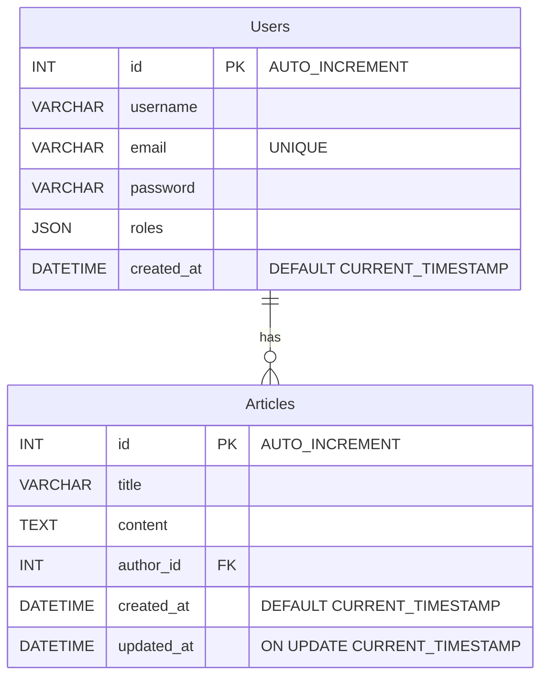

# COZENOT Sylvain, HERVOUET Chloé

## TABLE DES MATIERES

- [Lancement du projet](#lancement-du-projet)
- [MCD](#mcd)
- [Remarques](#remarques)
- [Références](#références)
- [Veille](#veille)

## Lancement du projet

Pour lancer le projet en local, il faut utiliser la commande `symfony serve`.
Pour générer la base de données (attention il s'agit de postgreSQL) il faut exécuter les commandes suivantes `php bin/console make:migration` ensuite `php bin/console doctrine:migration:migrate` puis `psql -U /nomDeLaBDD`
Ne pas oublier de modifier les informations de base de données dans le `.env`.

## MCD

# Schéma de la base de données

## Remarques

Déjà que j'ai du mal en PHP vanilla, j'avais oublié à quel point Symfony était si demandant. Heureusement que les messages d'erreurs sont simples à lire et à comprendre. Genre par exemple j'avais complétement oublié l'existence de twig. Bon, symfony me la vite fait comprendre. Il a fallut également que je revois tout ce qui a court aux migrations de bases de données. Vraiment je pense que j'ai fait de mon mieux ici. (Chloé)

## Références

- [Framework PHP](https://github.com/paul-schuhm/framework-php)
- [Symfony Documentation](https://symfony.com/doc/current/page_creation.html)

## Veille

